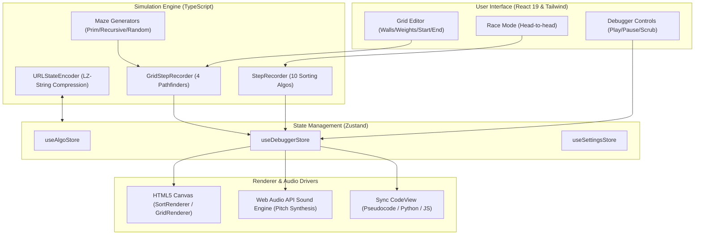

# ⚡ Deterministic Algorithm Execution Debugger

<div align="center">

[](https://vite.dev/)
[](https://react.dev/)
[](https://www.typescriptlang.org/)
[](https://tailwindcss.com/)
[](https://github.com/pmndrs/zustand)
[](https://algoplay-dpu7q6owi-janak-kabras-projects.vercel.app/dashboard)
[](LICENSE)

**A high-performance, interactive, and beautifully designed sorting, pathfinding, graphs, BST trees, and DP debugger built for modern browsers.**

[Live Application](https://algoplay-dpu7q6owi-janak-kabras-projects.vercel.app/dashboard) • [Report Bug](https://github.com/Jenak26/deterministic-algorithm-execution-debugger/issues) • [Request Feature](https://github.com/Jenak26/deterministic-algorithm-execution-debugger/issues)

</div>

---

## 🎯 Value Proposition & Performance

**Deterministic Algorithm Execution Debugger** was built to bridge the gap between abstract algorithmic concepts and visual intuition. Instead of treating algorithms as black boxes that run instantly, this debugger acts as a **full-featured debugger** for code execution. 

Unlike basic visualizers that suffer from DOM-rendering bottlenecks, it is engineered for exceptional performance:
*   **60 FPS Hardware-Accelerated Canvas Rendering:** Custom canvas-based renderer bypasses React DOM diffing overhead, ensuring butter-smooth animations even with large arrays or dense grids.
*   **Zero-Allocation Step Recorder:** Algorithms run to completion instantly in a lightweight virtual container, generating a queue of immutable state snapshots (`StepSnapshot`/`GridSnapshot`) that are scrubbed, stepped, or replayed dynamically.
*   **Sub-Millisecond URL State Sharing:** Compresses entire grid states, wall layouts, and selected algorithms into a URL-safe hash using `LZ-String` (Lempel-Ziv-Welch compression) for instant sharing.

---

## 🕸 Core Architecture

The architecture decouples the UI state, the execution engine, and the visual/audio renderers:



---

## 🚀 Key Highlights & Features

> [!TIP]
> **Performance Tip:** You can dial the speed up to 100% to run algorithms with a `0ms` delay interval, or scrub the timeline back and forth to inspect exact operations.

*   **⚡ Head-to-Head Race Mode:** Compare up to 4 sorting algorithms concurrently on the same array configuration with independent finishing-place indicators and real-time operations counters.
*   **🗺 4-Directional Weighted Pathfinding:** Visualize Breadth-First Search, Depth-First Search, Dijkstra, and A* on dynamic grids containing impassable walls or heavy terrain (rivers/marshes) with weight cost analysis.
*   **🎵 Web Audio Sound Engine:** Transforms algorithm operations into pitch-synthesized sound waves. Elements in the array map to frequency ranges, making the visual progress audible.
*   **⚙ Synchronization Code View:** Synchronous step execution highlights the exact line of Pseudocode, Python, or JavaScript code being run at each transition.
*   **🌀 Procedural Maze Generation:** Generate perfect mazes instantly using Randomized Prim's Algorithm, Recursive Division, or basic Random Wall generation.

---

## 🛠 Tech Stack

*   **Framework:** [React 19](https://react.dev/) + [Vite 8](https://vite.dev/)
*   **Language:** [TypeScript 6](https://www.typescriptlang.org/) (Strict compilation enabled)
*   **State Management:** [Zustand 5](https://github.com/pmndrs/zustand) (Flux-like lightweight global state)
*   **Styling:** [Tailwind CSS 3](https://tailwindcss.com/) + Vanilla CSS Custom Variables
*   **Compression:** [LZ-String](https://github.com/pieroxy/lz-string) (For URL state encoding)
*   **Testing:** [Vitest](https://vitest.dev/) (Fast unit and integration runner)

---

## 📁 Directory Structure

```text
deterministic-algorithm-execution-debugger/
├── public/                  # Static assets & icons
├── src/
│   ├── components/          # Reusable UI components (AppShell, DebuggerControls, CodeView, etc.)
│   ├── engine/              # State recorders & URL encoders
│   │   ├── GridStepRecorder.ts
│   │   ├── StepRecorder.ts
│   │   ├── SoundEngine.ts
│   │   └── URLStateEncoder.ts
│   ├── hooks/               # Core React hooks (Canvas rendering, Keyboard shortcuts)
│   ├── modules/             # Primary algorithmic visualizer modules
│   │   ├── pathfinding/     # Grid layout, path algorithms, and mazes
│   │   └── sorting/         # Array sorting, race mode, and pseudocode snippets
│   ├── pages/               # Page entry wrappers (routed through App.tsx)
│   ├── renderer/            # Base HTML5 Canvas rendering class
│   ├── store/               # Zustand global state declarations
│   ├── styles/              # Tailwind directives and custom variables
│   ├── test/                # Core test suites (TDD coverage for all pathfinders & sorting)
│   ├── types/               # Strict TypeScript interface declarations
│   ├── App.tsx              # Main routing and layout wrapper
│   └── main.tsx             # Application entry point
├── tsconfig.json            # Solution TS configuration
└── vite.config.ts           # Vite dev/build configuration
```

---

## 🔧 Installation & Setup

### Local Development

1.  **Clone the repository:**
    ```bash
    git clone https://github.com/Jenak26/deterministic-algorithm-execution-debugger.git
    cd deterministic-algorithm-execution-debugger
    ```

2.  **Install dependencies:**
    ```bash
    npm install
    ```

3.  **Run the test suite:**
    ```bash
    npm run test
    ```

4.  **Start the local development server:**
    ```bash
    npm run dev
    ```

5.  **Build the application for production:**
    ```bash
    npm run build
    ```

---

## 🌐 Production Deployment

### Deploy to Vercel

This repository is optimized for SPA deployments. To connect and deploy to Vercel:

1.  Push the code to your GitHub repository.
2.  Import the project into Vercel.
3.  Ensure the following settings are set:
    *   **Framework Preset:** Vite
    *   **Build Command:** `npm run build`
    *   **Output Directory:** `dist`
4.  The `vercel.json` config is pre-configured to handle SPA routing redirects (`/* -> /index.html`).

---

## 💡 Why This Project & Key Learnings

### Why was it built?
Most visualizers are built with standard DOM nodes, causing performance throttling when sorting thousands of items. By using **HTML5 Canvas** for rendering and **Zustand** for state, the presentation layer is decoupled from the algorithmic execution layer. 

### Key Engineering Achievements:
1.  **Strict State Decoupling:** Separation of step recording (CPU-bound) from playback loop (timing-bound). This lets the user scrub through executions frame-by-frame with zero lag.
2.  **LZ-String Compression:** Encoding grid array states into compact base64 strings meant sharing did not require a database, saving cost and reducing server latency to `0ms`.
3.  **Strict TypeScript Integration:** Moving from JavaScript to a fully typed solution configuration ensured strict typing rules, preventing runtime memory leak and rendering bugs before they hit production.

---

## 📄 License

Distributed under the MIT License. See `LICENSE` for more information.

